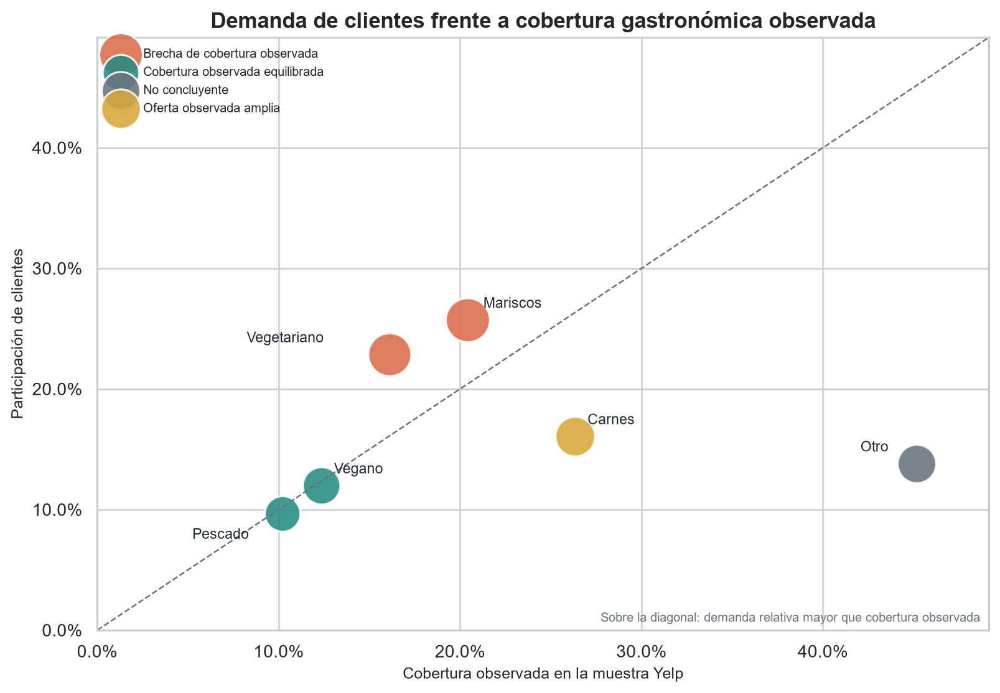
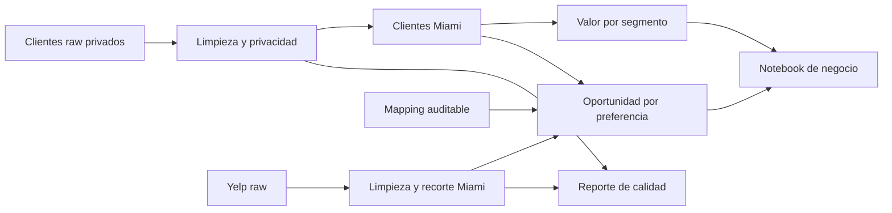

# 🍽️ Miami Restaurant Opportunity — ETL & Business Analytics

Proyecto de **ETL, calidad de datos y análisis de negocio** que integra una base educativa de clientes con una muestra de restaurantes de Yelp para identificar qué preferencias gastronómicas merecen una validación comercial más profunda en Miami.

> 🚀 **Puesta en producción:** 13/07/2026<br>
> 🎯 **Destinatario:** dirección de expansión o desarrollo de nuevos conceptos gastronómicos<br>
> 📓 **Reporte principal:** [Caso de negocio ejecutado en Jupyter](notebooks/01_miami_business_case.ipynb)



La diagonal representa equilibrio relativo. Los puntos por encima tienen más peso en clientes que cobertura en la muestra. El tamaño resume el gasto estimado del segmento. Yelp se interpreta como una muestra observable, no como un censo del mercado.

## 🧭 Navegación rápida

| Si eres... | Empieza por... |
|---|---|
| Dirección de expansión | Resumen ejecutivo, recomendación y notebook |
| Analista de negocio | Notebook, metodología y tablas finales |
| Revisor técnico | Pipeline, decisiones de limpieza, calidad y tests |

## 📌 Resumen ejecutivo

La capa analítica final contiene **3.183 clientes de Miami** y **719.624 unidades de gasto estimado por período**.

| Hallazgo | Resultado |
|---|---:|
| Clientes premium | 53,2 % de la base |
| Gasto concentrado en premium | 78,1 % |
| Clientes de estrato Muy Alto | 25,1 % |
| Gasto concentrado en estrato Muy Alto | 56,5 % |
| Preferencia con mayor gasto estimado | Mariscos — 178.967 unidades |
| Mayor brecha demanda/cobertura observada | Vegetariano |

### 💡 Recomendación

1. Validar primero propuestas orientadas a **Vegetariano** y **Mariscos**.
2. Diseñar la investigación alrededor de clientes de alto valor, combinando membresía y estrato.
3. No usar `Otro` para decidir: una parte relevante proviene de preferencias faltantes imputadas.
4. En `Carnes`, competir por diferenciación antes que por disponibilidad, porque la oferta observada es amplia.

El análisis **no recomienda abrir un restaurante directamente**. Reduce el espacio de decisión y define qué hipótesis deberían validarse antes de invertir.

## 🏗️ Arquitectura del proyecto



### Qué resuelve cada capa

- 🧹 **ETL:** transforma las fuentes y deja datos limpios, trazables y sin PII.
- 📊 **Capa de negocio:** calcula valor del cliente y oportunidad por preferencia.
- 📓 **Notebook:** convierte las tablas en hallazgos, recomendaciones y próximos pasos.
- ✅ **Validaciones y tests:** detienen el proceso ante problemas de claves, rangos, privacidad o reglas de negocio.
- 📝 **Documentación:** registra procedencia, transformaciones, métricas y limitaciones.

## 🗂️ Estructura

```text
ETLGITHUB/
  data/
    raw/          fuentes locales; el raw de clientes no se publica
    clean/        datos limpios sin PII
    final/        tablas listas para análisis y decisión
    reference/    mapping auditable de categorías

  notebooks/      caso de negocio ejecutado
  docs/           metodología, calidad, procedencia y gráficos
  src/            extracción, transformaciones y validaciones
  scripts/        setup, ejecución y renderizado
  tests/          controles de datos y lógica de negocio

  setup.bat         prepara el entorno de Windows
  run_pipeline.bat  regenera las tablas analíticas
  run_report.bat    regenera pipeline, notebook y gráficos
```

## ⚙️ Stack

- **Python 3.10+**
- **Pandas / NumPy** para transformación y cálculo
- **Requests** para extracción opcional desde Yelp Fusion API
- **Matplotlib / Seaborn** para visualización
- **Jupyter / nbclient** para el reporte reproducible
- **Pytest** para controles automatizados
- **PowerShell / BAT** para una ejecución sencilla en Windows

## ▶️ Cómo verificar el proyecto

### Opción A — Clon público, sin datos personales

El repositorio publica los outputs analíticos sin PII, el notebook ejecutado, gráficos y tests. Desde un clon nuevo se puede preparar el entorno, revisar los resultados y ejecutar la suite:

```powershell
.\setup.bat
.\.venv\Scripts\python.exe -m pytest -q
.\.venv\Scripts\python.exe scripts\render_notebook.py
```

### Opción B — Reconstrucción completa del ETL

La reconstrucción completa requiere un archivo compatible en:

```text
data/raw/customers_raw.csv
```

Ese raw no se publica porque contiene campos con apariencia de PII y su licencia no está confirmada. Una vez incorporada una fuente autorizada con el mismo esquema:

```powershell
.\setup.bat
.\run_report.bat
```

Para ejecutar solamente el pipeline:

```powershell
.\run_pipeline.bat
```

En otros sistemas:

```bash
python -m venv .venv
python -m pip install -r requirements.txt
python -m src.pipeline
python scripts/render_notebook.py
python -m pytest -q
```

> 🔐 La API key de Yelp sólo es necesaria para una extracción nueva. Debe guardarse en `.env` como `YELP_API_KEY`; el repositorio incluye un snapshot para el análisis y nunca versiona la clave.

## ✅ Calidad y pruebas

La suite actual contiene **12 pruebas automatizadas**. Comprueba, entre otras reglas:

- IDs únicos y rangos válidos;
- frecuencia y gasto no negativos;
- recorte exclusivo de clientes y restaurantes de Miami;
- ausencia de nombre, apellido, teléfono y correo en outputs de clientes;
- cálculo reproducible de gasto estimado;
- participaciones que reconcilian aproximadamente al 100 %;
- categorías cubiertas por el mapping;
- clasificación correcta de brecha, equilibrio y oferta amplia;
- tratamiento explícito de preferencias imputadas como evidencia no concluyente.

Ejecución validada antes de la publicación:

```text
12 passed
Pipeline completo
Notebook ejecutado y guardado correctamente
```

El reporte operativo está disponible en [docs/data_quality_report.md](docs/data_quality_report.md).

## 📦 Outputs principales

- [`customer_value_miami.csv`](data/final/customer_value_miami.csv): valor por membresía y estrato.
- [`preference_opportunity_miami.csv`](data/final/preference_opportunity_miami.csv): demanda, gasto, cobertura y acción sugerida.
- [`01_miami_business_case.ipynb`](notebooks/01_miami_business_case.ipynb): caso completo con outputs guardados.
- [`docs/assets/`](docs/assets/): gráficos listos para revisar en GitHub.
- [`data_quality_report.md`](docs/data_quality_report.md): controles generados por el pipeline.

## 📚 Documentación

| Documento | Para qué sirve |
|---|---|
| [business_methodology.md](docs/business_methodology.md) | Explica métricas, umbrales y recomendaciones. |
| [cleaning_decisions.md](docs/cleaning_decisions.md) | Registra qué se corrigió y por qué. |
| [data_dictionary.md](docs/data_dictionary.md) | Define columnas y archivos finales. |
| [data_provenance.md](docs/data_provenance.md) | Aclara origen, privacidad y límites de uso. |
| [data_quality_report.md](docs/data_quality_report.md) | Presenta controles generados por el pipeline. |
| [tests.md](docs/tests.md) | Resume qué protege la suite de pruebas. |

## 🔎 Alcance y limitaciones

- El dataset de clientes procede de una entrega educativa sin licencia, muestreo ni moneda documentados.
- No se afirma que los clientes representen a la población de Miami.
- La unidad temporal de `frecuencia_visita` no está documentada; por eso se usa **gasto estimado por período**, no gasto mensual.
- Yelp aporta una muestra limitada y ordenada, no aleatoria ni censal.
- Un restaurante puede relacionarse con varias preferencias; la métrica es **cobertura observada**, no cuota de mercado.
- No hay costos, márgenes, alquileres, elasticidad de precio ni evidencia causal.

La metodología completa está en [business_methodology.md](docs/business_methodology.md) y la procedencia en [data_provenance.md](docs/data_provenance.md).

## 🔐 Privacidad y publicación responsable

Los outputs `clean` y `final` eliminan nombre, apellido, teléfono y correo de clientes. `data/raw/customers_raw.csv` está ignorado por Git y no debe publicarse hasta confirmar que los datos son sintéticos o que existe permiso de uso.

Si un raw con PII hubiera sido versionado alguna vez, agregarlo a `.gitignore` no sería suficiente: también tendría que retirarse del historial antes de publicar.

## ⚖️ Licencia y terceros

El **código y la documentación original** de este repositorio se distribuyen bajo la [licencia MIT](LICENSE).

Esta licencia no concede derechos sobre los datasets de origen, sus registros ni las marcas de terceros. La fuente educativa de clientes mantiene su situación de licencia no confirmada y no se publica. Yelp, su nombre y sus marcas pertenecen a sus respectivos titulares; este proyecto es independiente y no está patrocinado ni afiliado con Yelp.

---

**Percy Ignacio Marzoratti Hill**<br>
*Data Analyst | Business Intelligence | ETL & Data Quality*
