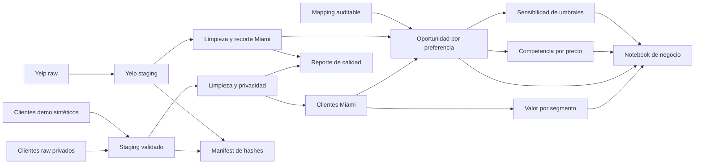

# 🍽️ Miami Restaurant Opportunity — ETL & Business Analytics

[](https://github.com/HeKoXCode/miami-restaurant-opportunity-etl/actions/workflows/public-verification.yml)
[](https://github.com/HeKoXCode/miami-restaurant-opportunity-etl/actions/workflows/public-verification.yml)
[](LICENSE)

Proyecto de **ETL, calidad de datos y análisis de negocio** que integra una base educativa de clientes con una muestra de restaurantes de Yelp para identificar qué preferencias gastronómicas merecen una validación comercial más profunda en Miami.

> 🚀 **Puesta en producción:** 13/07/2026<br>
> 🎯 **Destinatario:** dirección de expansión o desarrollo de nuevos conceptos gastronómicos<br>
> 📓 **Reporte principal:** [Caso de negocio ejecutado en Jupyter](notebooks/01_miami_business_case.ipynb)


La diagonal representa equilibrio relativo. Los puntos por encima tienen más peso en clientes que cobertura en la muestra. El tamaño resume el gasto estimado del segmento. Yelp se interpreta como una muestra observable, no como un censo del mercado.

## 🧭 Navegación rápida

| Si eres... | Empieza por... |
|---|---|
| Dirección de expansión | Resumen ejecutivo, recomendación y notebook |
| Analista de negocio | Notebook, metodología y tablas finales |
| Revisor técnico | Pipeline, decisiones de limpieza, calidad y tests |

## 📌 Resumen ejecutivo

La capa analítica final contiene **3.183 clientes de Miami** y **719.624 unidades de gasto estimado por período**.

| Hallazgo | Resultado |
|---|---:|
| Clientes premium | 53,2 % de la base |
| Gasto concentrado en premium | 78,1 % |
| Clientes de estrato Muy Alto | 25,1 % |
| Gasto concentrado en estrato Muy Alto | 56,5 % |
| Preferencia con mayor gasto estimado | Mariscos — 178.967 unidades |
| Mayor brecha demanda/cobertura observada | Vegetariano |
| Robustez de la brecha | Sensible: Mariscos y Vegetariano pasan a equilibrada en el escenario conservador |

### 💡 Recomendación

1. Usar **Vegetariano** y **Mariscos** para validaciones exploratorias; la brecha no es robusta al umbral conservador.
2. Diseñar la investigación alrededor de clientes de alto valor, combinando membresía y estrato.
3. No usar `Otro` para decidir: una parte relevante proviene de preferencias faltantes imputadas.
4. En `Carnes`, competir por diferenciación antes que por disponibilidad, porque la oferta observada es amplia.
5. Investigar primero la banda de precio Yelp nivel 2, aclarando que cerca de 4 de cada 10 precios relacionados fueron imputados.

El análisis **no recomienda abrir un restaurante directamente**. Reduce el espacio de decisión y define qué hipótesis deberían validarse antes de invertir.

## 🏗️ Arquitectura del proyecto



### Qué resuelve cada capa

- 🧹 **ETL:** transforma las fuentes y deja datos limpios, trazables y sin PII.
- 🧪 **Demo reproducible:** genera 750 clientes totalmente sintéticos con semilla fija y ejecuta el ETL completo sin depender del raw privado.
- ♻️ **Ejecución incremental:** detecta snapshots sin cambios mediante hashes y conserva un `run_id` determinista.
- 📊 **Capa de negocio:** calcula valor del cliente y oportunidad por preferencia.
- 🔬 **Robustez analítica:** compara bandas de precio y tres escenarios de umbrales.
- 📓 **Notebook:** convierte las tablas en hallazgos, recomendaciones y próximos pasos.
- ✅ **Validaciones y tests:** detienen el proceso ante problemas de claves, rangos, privacidad o reglas de negocio.
- 📝 **Documentación:** registra procedencia, transformaciones, métricas y limitaciones.

## 🗂️ Estructura

```text
ETLGITHUB/
  data/
    raw/          fuentes locales; el raw de clientes no se publica
    staging/      snapshots validados; el full permanece fuera de Git
    clean/        datos limpios sin PII
    final/        tablas listas para análisis y decisión
    reference/    mapping auditable de categorías
    demo/         entrada sintética, outputs y evidencia aislados

  notebooks/      caso de negocio ejecutado
  docs/           metodología, calidad, procedencia y gráficos
  src/            extracción, transformaciones y validaciones
  scripts/        setup, ejecución y renderizado
  tests/          controles de datos y lógica de negocio

  setup.bat         prepara el entorno de Windows
  run_demo.bat      ejecuta el ETL reproducible con datos sintéticos
  run_pipeline.bat  regenera las tablas analíticas
  run_report.bat    regenera pipeline, notebook y gráficos
```

## ⚙️ Stack

- **Python 3.12–3.14**; validado con **Python 3.14.3**
- **Pandas / NumPy** para transformación y cálculo
- **Requests** para extracción opcional desde Yelp Fusion API
- **Matplotlib / Seaborn** para visualización
- **Jupyter / nbclient** para el reporte reproducible
- **Pytest** para controles automatizados
- **Ruff** para lint reproducible
- **Contratos de datos versionados** para esquema, tipos, nulos y rangos
- **PowerShell / BAT** para una ejecución sencilla en Windows

## ▶️ Cómo verificar el proyecto

### Opción A — Demo reproducible desde un clon público

La ruta recomendada genera **750 clientes totalmente sintéticos** con la semilla fija `20260713`, ejecuta todas las transformaciones y guarda la evidencia en `data/demo/`, separada del caso real:

```powershell
.\setup.bat
.\run_demo.bat
.\.venv\Scripts\python.exe -m pytest -q
.\.venv\Scripts\python.exe scripts\validate_publication.py --mode demo
```

El generador usa identidades marcadas como demo, correos `example.invalid` y teléfonos del rango reservado `202-555-01xx`. Una segunda ejecución produce exactamente los mismos archivos para la misma semilla.

Para comprobar explícitamente el modo incremental después de la reconstrucción:

```powershell
.\.venv\Scripts\python.exe -m src.pipeline --mode demo
```

El resultado debe indicar `unchanged` y conservar el mismo `run_id`.

### Opción B — Reconstrucción completa del ETL

La reconstrucción completa requiere un archivo compatible en:

```text
data/raw/customers_raw.csv
```

Ese raw no se publica porque contiene campos con apariencia de PII y su licencia no está confirmada. Una vez incorporada una fuente autorizada con el mismo esquema:

```powershell
.\setup.bat
.\run_report.bat
```

Para ejecutar solamente el pipeline:

```powershell
.\run_pipeline.bat
```

En otros sistemas, donde el lock de Windows todavía no fue validado:

```bash
python -m venv .venv
python -m pip install -r requirements.in
python -m src.pipeline --mode demo
python scripts/validate_publication.py --mode demo
python scripts/render_notebook.py
python -m pytest -q
```

### Verificación C3-Lite

La puerta final reúne lint, tests, dos reconstrucciones demo, cache incremental, presupuestos de rendimiento, privacidad, notebook y consistencia documental:

```powershell
.\.venv\Scripts\python.exe scripts\verify_c3_lite.py
```

Quien tenga el raw privado autorizado puede añadir `--include-full`. La evidencia verificada está en [docs/c3_lite_verification.md](docs/c3_lite_verification.md).

### Dependencias reproducibles

- `requirements.in` declara únicamente las **11 dependencias directas**.
- `requirements.lock` fija **104 paquetes directos y transitivos** con hashes.
- `requirements.txt` instala el lock verificado y conserva el comando habitual de setup.

El lock versionado fue generado y probado en **Windows 11 con Python 3.14.3**. El rango aceptado por el setup es Python 3.12–3.14; para declarar otra plataforma como reproducible se debe regenerar y validar allí su propio lock.

Para regenerar el lock de forma intencional:

```powershell
python -m pip install pip-tools
python -m piptools compile --generate-hashes --strip-extras --resolver=backtracking --output-file requirements.lock requirements.in
```

Después de actualizarlo deben repetirse el pipeline, las pruebas y el renderizado del notebook antes de aceptar el cambio.

> 🔐 La API key de Yelp sólo es necesaria para una extracción nueva. Debe guardarse en `.env` como `YELP_API_KEY`; el repositorio incluye un snapshot para el análisis y nunca versiona la clave.

## ✅ Calidad y pruebas

La suite actual contiene **24 pruebas automatizadas**. El workflow de verificación pública ejecuta lint, tests, el pipeline demo completo, validaciones de privacidad, el notebook y C3-Lite en **Python 3.12, 3.13 y 3.14 sobre Windows**. Además conserva los outputs demo como artefacto de cada ejecución. Comprueba, entre otras reglas:

- IDs únicos y rangos válidos;
- frecuencia y gasto no negativos;
- recorte exclusivo de clientes y restaurantes de Miami;
- ausencia de nombre, apellido, teléfono y correo en outputs de clientes;
- cálculo reproducible de gasto estimado;
- participaciones que reconcilian aproximadamente al 100 %;
- categorías cubiertas por el mapping;
- clasificación correcta de brecha, equilibrio y oferta amplia;
- tratamiento explícito de preferencias imputadas como evidencia no concluyente.
- contratos de entrada y salida con esquema `1.1.0`;
- reconciliación de filas rechazadas y causas;
- determinismo del generador y del pipeline demo;
- separación entre cálculos reutilizables y narrativa del notebook.
- publicación atómica con restauración ante fallos;
- detección incremental mediante manifiestos y hashes;
- contratos de los marts de competencia y sensibilidad;
- presupuestos de 10 segundos y 256 MiB para la demo pública.

Ejecución validada antes de la publicación:

```text
24 passed
Pipeline full y demo completos
Notebook: 27 celdas, 10 de código, 0 errores y 6 gráficos
C3-Lite aprobado
```

El reporte operativo está disponible en [docs/data_quality_report.md](docs/data_quality_report.md).

> El workflow reconstruye el ETL demo desde cero en cada push. El caso completo con la fuente educativa original sigue siendo local porque ese raw no se publica.

## 📦 Outputs principales

- [`customer_value_miami.csv`](data/final/customer_value_miami.csv): valor por membresía y estrato.
- [`preference_opportunity_miami.csv`](data/final/preference_opportunity_miami.csv): demanda, gasto, cobertura y acción sugerida.
- [`restaurant_competition_miami.csv`](data/final/restaurant_competition_miami.csv): cobertura por preferencia y banda de precio, incluida la proporción imputada.
- [`preference_sensitivity_miami.csv`](data/final/preference_sensitivity_miami.csv): señal bajo escenarios conservador, base y exploratorio.
- [`pipeline_manifest.json`](data/final/pipeline_manifest.json): hashes, filas, versiones y `run_id` reproducible.
- [`data_quality_report.csv`](data/final/data_quality_report.csv): métricas de calidad legibles por máquina.
- [`data_rejections.csv`](data/final/data_rejections.csv): cantidad de descartes por etapa y causa.
- [`data/demo/`](data/demo/): pipeline completo con fuente sintética y metadatos de generación.
- [`01_miami_business_case.ipynb`](notebooks/01_miami_business_case.ipynb): caso completo con outputs guardados.
- [`docs/assets/`](docs/assets/): gráficos listos para revisar en GitHub.
- [`data_quality_report.md`](docs/data_quality_report.md): controles generados por el pipeline.

## 📚 Documentación

| Documento | Para qué sirve |
|---|---|
| [business_methodology.md](docs/business_methodology.md) | Explica métricas, umbrales y recomendaciones. |
| [cleaning_decisions.md](docs/cleaning_decisions.md) | Registra qué se corrigió y por qué. |
| [data_dictionary.md](docs/data_dictionary.md) | Define columnas y archivos finales. |
| [data_contracts.md](docs/data_contracts.md) | Declara contratos, versión de esquema y política de cambios. |
| [pipeline_operations.md](docs/pipeline_operations.md) | Explica staging, incrementalidad, manifiestos, rollback y métricas. |
| [next_experiment_design.md](docs/next_experiment_design.md) | Convierte la sensibilidad C2 en una prueba comercial predefinida. |
| [data_provenance.md](docs/data_provenance.md) | Aclara origen, privacidad y límites de uso. |
| [data_quality_report.md](docs/data_quality_report.md) | Presenta controles generados por el pipeline. |
| [tests.md](docs/tests.md) | Resume qué protege la suite de pruebas. |
| [consistency_review.md](docs/consistency_review.md) | Registra la revisión final y sus pendientes deliberados. |
| [performance_baseline.json](docs/performance_baseline.json) | Registra cinco benchmarks demo y presupuestos de regresión. |
| [c3_lite_verification.md](docs/c3_lite_verification.md) | Consolida la puerta técnica final y su evidencia. |

## 🔎 Alcance y limitaciones

- El dataset de clientes procede de una entrega educativa sin licencia, muestreo ni moneda documentados.
- No se afirma que los clientes representen a la población de Miami.
- La unidad temporal de `frecuencia_visita` no está documentada; por eso se usa **gasto estimado por período**, no gasto mensual.
- Yelp aporta una muestra limitada y ordenada, no aleatoria ni censal.
- Un restaurante puede relacionarse con varias preferencias; la métrica es **cobertura observada**, no cuota de mercado.
- No hay costos, márgenes, alquileres, elasticidad de precio ni evidencia causal.
- Los precios Yelp faltantes se imputan y se exponen como proporción; no representan disposición a pagar.
- El demo verifica la reproducibilidad técnica, pero no reemplaza la evidencia del caso educativo ni demuestra representatividad comercial.

La metodología completa está en [business_methodology.md](docs/business_methodology.md) y la procedencia en [data_provenance.md](docs/data_provenance.md).

## 🔐 Privacidad y publicación responsable

Los outputs `clean` y `final` eliminan nombre, apellido, teléfono y correo de clientes. `data/raw/customers_raw.csv` está ignorado por Git y no debe publicarse hasta confirmar que existe permiso de uso. La única entrada de clientes publicada está en `data/demo/raw/` y es totalmente sintética.

Si un raw con PII hubiera sido versionado alguna vez, agregarlo a `.gitignore` no sería suficiente: también tendría que retirarse del historial antes de publicar.

## ⚖️ Licencia y terceros

El **código y la documentación original** de este repositorio se distribuyen bajo la [licencia MIT](LICENSE).

Esta licencia no concede derechos sobre los datasets de origen, sus registros ni las marcas de terceros. La fuente educativa de clientes mantiene su situación de licencia no confirmada y no se publica. Yelp, su nombre y sus marcas pertenecen a sus respectivos titulares; este proyecto es independiente y no está patrocinado ni afiliado con Yelp.

---

**Percy Ignacio Marzoratti Hill**<br>
*Data Analyst | Business Intelligence | ETL & Data Quality*
