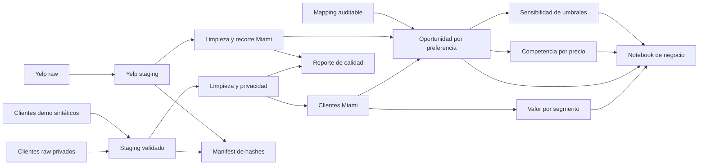

# 🍽️ Miami Restaurant Opportunity — ETL & Business Analytics

[](https://github.com/HeKoXCode/miami-restaurant-opportunity-etl/actions/workflows/public-verification.yml)
[](https://github.com/HeKoXCode/miami-restaurant-opportunity-etl/actions/workflows/public-verification.yml)
[](LICENSE)

En este proyecto integré una base educativa de clientes con una muestra de restaurantes de Yelp para que puedas identificar qué preferencias gastronómicas merecen una validación comercial más profunda en Miami. Para hacerlo, construí un flujo de **ETL, calidad de datos y análisis de negocio** reproducible y auditable.

> 🚀 **Puesta en producción:** 13/07/2026<br>
> 🎯 **Destinatario:** dirección de expansión o desarrollo de nuevos conceptos gastronómicos<br>
> 📓 **Reporte principal:** [Caso de negocio ejecutado en Jupyter](notebooks/01_miami_business_case.ipynb)


Cuando leas el gráfico, usa la diagonal como referencia de equilibrio relativo: los puntos por encima tienen más peso en clientes que cobertura en la muestra y el tamaño resume el gasto estimado del segmento. Interpreta Yelp como una muestra observable, no como un censo del mercado.

## 🧭 Navegación rápida

| Si eres... | Empieza por... |
|---|---|
| Dirección de expansión | Resumen ejecutivo, recomendación y notebook |
| Analista de negocio | Notebook, metodología y tablas finales |
| Revisor técnico | Pipeline, decisiones de limpieza, calidad y tests |

## 📌 Resumen ejecutivo

En mi capa analítica final encontrarás **3.183 clientes de Miami** y **719.624 unidades de gasto estimado por período**.

| Hallazgo | Resultado |
|---|---:|
| Clientes premium | 53,2 % de la base |
| Gasto concentrado en premium | 78,1 % |
| Clientes de estrato Muy Alto | 25,1 % |
| Gasto concentrado en estrato Muy Alto | 56,5 % |
| Preferencia con mayor gasto estimado | Mariscos — 178.967 unidades |
| Mayor brecha demanda/cobertura observada | Vegetariano |
| Robustez de la brecha | Sensible: Mariscos y Vegetariano pasan a equilibrada en el escenario conservador |

### 💡 Recomendación

1. Te recomiendo usar **Vegetariano** y **Mariscos** para validaciones exploratorias; la brecha no es robusta al umbral conservador.
2. Diseña la investigación alrededor de clientes de alto valor, combinando membresía y estrato.
3. No uses `Otro` para decidir: una parte relevante proviene de preferencias faltantes imputadas.
4. En `Carnes`, compite por diferenciación antes que por disponibilidad, porque la oferta observada es amplia.
5. Investiga primero la banda de precio Yelp nivel 2 y ten en cuenta que cerca de 4 de cada 10 precios relacionados fueron imputados.

Con este análisis **no te recomiendo abrir un restaurante directamente**. Mi objetivo es reducir tu espacio de decisión y dejar explícitas las hipótesis que deberías validar antes de invertir.

## 🏗️ Arquitectura del proyecto



### Qué puedes verificar en cada capa

- 🧹 **ETL:** transformo las fuentes y te entrego datos limpios, trazables y sin PII.
- 🧪 **Demo reproducible:** genero 750 clientes totalmente sintéticos con semilla fija para que ejecutes el ETL completo sin depender del raw privado.
- ♻️ **Ejecución incremental:** detecto snapshots sin cambios mediante hashes y conservo un `run_id` determinista.
- 📊 **Capa de negocio:** calculo valor del cliente y oportunidad por preferencia.
- 🔬 **Robustez analítica:** comparo bandas de precio y tres escenarios de umbrales.
- 📓 **Notebook:** convierto las tablas en hallazgos, recomendaciones y próximos pasos que puedes revisar en GitHub.
- ✅ **Validaciones y tests:** detengo el proceso ante problemas de claves, rangos, privacidad o reglas de negocio.
- 📝 **Documentación:** te muestro la procedencia, las transformaciones, las métricas y las limitaciones.

## 🗂️ Estructura

```text
ETLGITHUB/
  data/
    raw/          fuentes locales; el raw de clientes no se publica
    staging/      snapshots validados; el full permanece fuera de Git
    clean/        datos limpios sin PII
    final/        tablas listas para análisis y decisión
    reference/    mapping auditable de categorías
    demo/         entrada sintética, outputs y evidencia aislados

  notebooks/      caso de negocio ejecutado
  docs/           metodología, calidad, procedencia y gráficos
  src/            extracción, transformaciones y validaciones
  scripts/        setup, ejecución y renderizado
  tests/          controles de datos y lógica de negocio

  setup.bat         prepara el entorno de Windows
  run_demo.bat      ejecuta el ETL reproducible con datos sintéticos
  run_pipeline.bat  regenera las tablas analíticas
  run_report.bat    regenera pipeline, notebook y gráficos
```

## ⚙️ Stack que utilicé

- **Python 3.12–3.14**; validado con **Python 3.14.3**
- **Pandas / NumPy** para transformación y cálculo
- **Requests** para extracción opcional desde Yelp Fusion API
- **Matplotlib / Seaborn** para visualización
- **Jupyter / nbclient** para el reporte reproducible
- **Pytest** para controles automatizados
- **Ruff** para lint reproducible
- **Contratos de datos versionados** para esquema, tipos, nulos y rangos
- **PowerShell / BAT** para una ejecución sencilla en Windows

## ▶️ Cómo verificar el proyecto

### Opción A — Demo reproducible desde un clon público

Te recomiendo empezar por esta ruta: generarás **750 clientes totalmente sintéticos** con la semilla fija `20260713`, ejecutarás todas las transformaciones y guardarás la evidencia en `data/demo/`, separada del caso real:

```powershell
.\setup.bat
.\run_demo.bat
.\.venv\Scripts\python.exe -m pytest -q
.\.venv\Scripts\python.exe scripts\validate_publication.py --mode demo
```

Diseñé el generador con identidades marcadas como demo, correos `example.invalid` y teléfonos del rango reservado `202-555-01xx`. Si lo ejecutas una segunda vez con la misma semilla, obtendrás exactamente los mismos archivos.

Para comprobar explícitamente el modo incremental después de la reconstrucción:

```powershell
.\.venv\Scripts\python.exe -m src.pipeline --mode demo
```

Deberías ver `unchanged` y el mismo `run_id`.

### Opción B — Reconstrucción completa del ETL

Si quieres reconstruir el caso completo, coloca un archivo compatible en:

```text
data/raw/customers_raw.csv
```

No publico ese raw porque contiene campos con apariencia de PII y su licencia no está confirmada. Una vez que incorpores una fuente autorizada con el mismo esquema, ejecuta:

```powershell
.\setup.bat
.\run_report.bat
```

Para ejecutar solamente el pipeline:

```powershell
.\run_pipeline.bat
```

En otros sistemas, donde todavía no validé el lock de Windows, usa:

```bash
python -m venv .venv
python -m pip install -r requirements.in
python -m src.pipeline --mode demo
python scripts/validate_publication.py --mode demo
python scripts/render_notebook.py
python -m pytest -q
```

### Verificación C3-Lite

Para la puerta final, reuní lint, tests, dos reconstrucciones demo, caché incremental, presupuestos de rendimiento, privacidad, notebook y consistencia documental en un solo comando:

```powershell
.\.venv\Scripts\python.exe scripts\verify_c3_lite.py
```

Si tienes autorización para usar el raw privado, puedes añadir `--include-full`. Revisa la evidencia que verifiqué en [docs/c3_lite_verification.md](docs/c3_lite_verification.md).

### Dependencias reproducibles

- En `requirements.in` declaré únicamente las **11 dependencias directas**.
- En `requirements.lock` fijé **104 paquetes directos y transitivos** con hashes.
- Con `requirements.txt` puedes instalar el lock verificado y conservar el comando habitual de setup.

Generé y probé el lock versionado en **Windows 11 con Python 3.14.3**. Configuré el setup para aceptar Python 3.12–3.14; antes de declarar otra plataforma como reproducible, regenera y valida allí tu propio lock.

Para regenerar el lock de forma intencional:

```powershell
python -m pip install pip-tools
python -m piptools compile --generate-hashes --strip-extras --resolver=backtracking --output-file requirements.lock requirements.in
```

Después de actualizarlo, repite el pipeline, las pruebas y el renderizado del notebook antes de aceptar el cambio.

> 🔐 Sólo necesitas la API key de Yelp para una extracción nueva. Guárdala en `.env` como `YELP_API_KEY`; incluí un snapshot para que ejecutes el análisis sin versionar nunca la clave.

## ✅ Calidad y pruebas

Incluí **24 pruebas automatizadas**. Configuré el workflow de verificación pública para ejecutar lint, tests, el pipeline demo completo, validaciones de privacidad, el notebook y C3-Lite en **Python 3.12, 3.13 y 3.14 sobre Windows**; además, conserva los outputs demo como artefacto de cada ejecución. Cuando lo ejecutes, comprobarás, entre otras reglas:

- IDs únicos y rangos válidos;
- frecuencia y gasto no negativos;
- recorte exclusivo de clientes y restaurantes de Miami;
- ausencia de nombre, apellido, teléfono y correo en outputs de clientes;
- cálculo reproducible de gasto estimado;
- participaciones que reconcilian aproximadamente al 100 %;
- categorías cubiertas por el mapping;
- clasificación correcta de brecha, equilibrio y oferta amplia;
- tratamiento explícito de preferencias imputadas como evidencia no concluyente.
- contratos de entrada y salida con esquema `1.1.0`;
- reconciliación de filas rechazadas y causas;
- determinismo del generador y del pipeline demo;
- separación entre cálculos reutilizables y narrativa del notebook.
- publicación atómica con restauración ante fallos;
- detección incremental mediante manifiestos y hashes;
- contratos de los marts de competencia y sensibilidad;
- presupuestos de 10 segundos y 256 MiB para la demo pública.

Antes de publicar, validé esta ejecución:

```text
24 passed
Pipeline full y demo completos
Notebook: 27 celdas, 10 de código, 0 errores y 6 gráficos
C3-Lite aprobado
```

Puedes revisar mi reporte operativo en [docs/data_quality_report.md](docs/data_quality_report.md).

> Configuré el workflow para reconstruir el ETL demo desde cero en cada push. Mantengo local el caso completo con la fuente educativa original porque no publico ese raw.

## 📦 Outputs que puedes revisar

- [`customer_value_miami.csv`](data/final/customer_value_miami.csv): valor por membresía y estrato.
- [`preference_opportunity_miami.csv`](data/final/preference_opportunity_miami.csv): demanda, gasto, cobertura y acción sugerida.
- [`restaurant_competition_miami.csv`](data/final/restaurant_competition_miami.csv): cobertura por preferencia y banda de precio, incluida la proporción imputada.
- [`preference_sensitivity_miami.csv`](data/final/preference_sensitivity_miami.csv): señal bajo escenarios conservador, base y exploratorio.
- [`pipeline_manifest.json`](data/final/pipeline_manifest.json): hashes, filas, versiones y `run_id` reproducible.
- [`data_quality_report.csv`](data/final/data_quality_report.csv): métricas de calidad legibles por máquina.
- [`data_rejections.csv`](data/final/data_rejections.csv): cantidad de descartes por etapa y causa.
- [`data/demo/`](data/demo/): pipeline completo con fuente sintética y metadatos de generación.
- [`01_miami_business_case.ipynb`](notebooks/01_miami_business_case.ipynb): caso completo con outputs guardados.
- [`docs/assets/`](docs/assets/): gráficos listos para revisar en GitHub.
- [`data_quality_report.md`](docs/data_quality_report.md): controles generados por el pipeline.

## 📚 Documentación para profundizar

| Documento | Para qué sirve |
|---|---|
| [business_methodology.md](docs/business_methodology.md) | Explica métricas, umbrales y recomendaciones. |
| [cleaning_decisions.md](docs/cleaning_decisions.md) | Registra qué se corrigió y por qué. |
| [data_dictionary.md](docs/data_dictionary.md) | Define columnas y archivos finales. |
| [data_contracts.md](docs/data_contracts.md) | Declara contratos, versión de esquema y política de cambios. |
| [pipeline_operations.md](docs/pipeline_operations.md) | Explica staging, incrementalidad, manifiestos, rollback y métricas. |
| [next_experiment_design.md](docs/next_experiment_design.md) | Convierte la sensibilidad C2 en una prueba comercial predefinida. |
| [data_provenance.md](docs/data_provenance.md) | Aclara origen, privacidad y límites de uso. |
| [data_quality_report.md](docs/data_quality_report.md) | Presenta controles generados por el pipeline. |
| [tests.md](docs/tests.md) | Resume qué protege la suite de pruebas. |
| [consistency_review.md](docs/consistency_review.md) | Registra la revisión final y sus pendientes deliberados. |
| [performance_baseline.json](docs/performance_baseline.json) | Registra cinco benchmarks demo y presupuestos de regresión. |
| [c3_lite_verification.md](docs/c3_lite_verification.md) | Consolida la puerta técnica final y su evidencia. |

## 🔎 Alcance y limitaciones que debes considerar

- El dataset de clientes procede de una entrega educativa sin licencia, muestreo ni moneda documentados.
- No se afirma que los clientes representen a la población de Miami.
- La unidad temporal de `frecuencia_visita` no está documentada; por eso se usa **gasto estimado por período**, no gasto mensual.
- Yelp aporta una muestra limitada y ordenada, no aleatoria ni censal.
- Un restaurante puede relacionarse con varias preferencias; la métrica es **cobertura observada**, no cuota de mercado.
- No hay costos, márgenes, alquileres, elasticidad de precio ni evidencia causal.
- Los precios Yelp faltantes se imputan y se exponen como proporción; no representan disposición a pagar.
- El demo verifica la reproducibilidad técnica, pero no reemplaza la evidencia del caso educativo ni demuestra representatividad comercial.

Si necesitas auditar mis decisiones, consulta la metodología completa en [business_methodology.md](docs/business_methodology.md) y la procedencia en [data_provenance.md](docs/data_provenance.md).

## 🔐 Privacidad y publicación responsable

Eliminé nombre, apellido, teléfono y correo de clientes en los outputs `clean` y `final`. También ignoré `data/raw/customers_raw.csv` en Git: no lo publiques hasta confirmar que existe permiso de uso. Para que puedas ejecutar el proyecto sin datos privados, publiqué una única entrada de clientes totalmente sintética en `data/demo/raw/`.

Si alguna vez versionas un raw con PII, agregarlo a `.gitignore` no será suficiente: también deberás retirarlo del historial antes de publicar.

## ⚖️ Licencia y terceros

Distribuyo el **código y la documentación original** de este repositorio bajo la [licencia MIT](LICENSE).

Ten en cuenta que esta licencia no te concede derechos sobre los datasets de origen, sus registros ni las marcas de terceros. Mantengo sin publicar la fuente educativa de clientes porque su licencia no está confirmada. Yelp, su nombre y sus marcas pertenecen a sus respectivos titulares; desarrollé este proyecto de forma independiente, sin patrocinio ni afiliación con Yelp.

---

**Percy Ignacio Marzoratti Hill**<br>
*Data Analyst | Business Intelligence | ETL & Data Quality*
